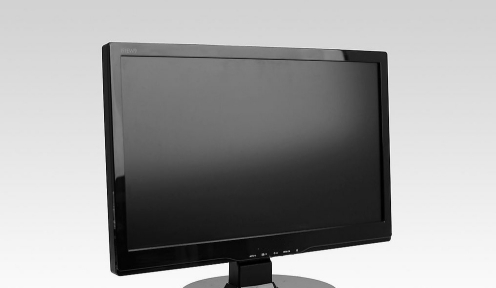

# Qualcomm® QCS610 SoC Open Kit PoseDetection-demo Developer documentation

## Introduce

This project relies on the QCS610 development kit, using the AI computing power and image processing capabilities of the development kit to collect images in real time, perform AI reasoning after preprocessing, and output the reasoning results. I use gstreamer and Snapdragon Neural Processing Engine SDK to complete the above functions. When the pipeline obtains valid image data, it will automatically collect the image, perform AI inference, and return the posture information of the human body.

The current deployment of deep learning is extremely hot, so I think it is necessary to deploy deep learning models in embedded devices.And pose detection is a very interesting demo.

The project was built in x86 host with across complier tool and has been tested in Qualcomm® QCS610 SoC device.

<center>Qualcomm® QCS610 SoC Development board</center>

<div align=center>

</div>


## Materials and Tools used for the project

1. Hardware materials

Except for the development board,The following hardware materials are also needed:

* Type-C usb line

using the usb line to develop on Qualcomm® QCS610 SoC development board.


* Charger

Direct power supply for Qualcomm® QCS610 SoC development board


* DP-Line

using the universal dp line to connect LED displayer to  Qualcomm® QCS610 SoC development board.


* LED-Displayer

using a LED Displayer to display the PoseDetection-demo interface from Qualcomm® QCS610 SoC development board.




## Environment configuration

This section mainly describes the source and configuration of some open source projects or third-party tools needed in the development process.

### Snapdragon Neural Processing Engine SDK

1. Download Snapdragon Neural Processing Engine SDK(version == 1.51.0)
[https://developer.qualcomm.com/software/qualcomm-neural-processing-sdk/tools](https://developer.qualcomm.com/software/qualcomm-neural-processing-sdk/tools)
2. Enter include/zdl/ in Snapdragon Neural Processing Engine SDK root directory,copy all dir to demo project_root_dir/inference/snpe/

### Qualcomm FastCV

1. Download Qualcomm FastCV-Linux
[https://developer.qualcomm.com/software/fastcv-sdk](https://developer.qualcomm.com/software/fastcv-sdk)
2. Get fastcv.h header file and copy to project_root_dir/gst_pipe/

### OpenCV

The version of OpenCV is 3.4.3.There are many tutorials for opencv installation on the network.Therefore, you can completely refer to other people's installation methods for installation and configuration.For example:[https://www.cnblogs.com/uestc-mm/p/7338244.html](https://www.cnblogs.com/uestc-mm/p/7338244.html)


### google Protobuf

1. Download google protobuf (version == 3.3)
[https://github.com/protocolbuffers/protobuf](https://github.com/protocolbuffers/protobuf)
2. Enter protobuf/src/google/ dir.Then,select all .h or .hpp .etc header file with maintain the structure of directory
3. copy header file dir to demo project_root_dir/pb_conf


## Compile

The compilation of the whole project is based on the yocto compilation tool, so you need to write some .bb and .conf files according to the specification. The link is [pose_detection_1.0.bb](https://github.com/ThunderSoft-XA/C610-PoseDetection-demo/blob/master/C610-PoseDetection-demo/pose_detection_1.0.bb) example.

Please refer to [the official Manual of Yocto](https://www.yoctoproject.org) for how to add layers,write layer.conf .Then,excute the command as follows:

```
bitbake pose_detection
```

you will get a  executable bin file named PoseDetection.Move it to the root of the source code.Next,push the whole project code to Qualcomm® QCS610 SoC device`s dir /data/.

```
adb root && adb disable-verity && adb reboot

adb root &&adb remount && adb shell mount -o remount,rw /

adb push xxx/xxx/sourcepath /data/

adb shell

cd data/PoseDetection-demo
```

## Configure and Usage

### 1. Configure

gstreamer pipeline google protobuf config:

| parameter| note |
| ---- | ---- | 
gstid=0             |       //gstreamer pipeline  ID
gstname=gst_zero    |  //gstreamer pipeline name
sinkname=gst_sink  |  //gstreamer pipeline appsink Plug-in name
gsttype=1          |             // gstreamer pipeline type ,0 = rtsp ,1 = camera, 2 = local file |
enable=on |
path=1     |                        // gstreamer pipeline source sink path ,rtsp = url,camera=camera id,local file = local video file path
decode=h264  |              // gstreamer pipeline decode type
framerate=30 | 
format=NV12 |
width=640 | 
height=360 |
hw_dec=1     |                //gstreamer pipeline hardware decode or software decode
calibration=1  |             //image frame need calibration or not, 1 = need

### 2. Usage

This project only provides a simple command line interface.

Run PoseDetection(This is the project name, the actual executable file name is PoseDetection, which can be modified in the CMakeListe.txt file in the root directory of the project )：

Run the **PoseDetection** test demo.This test demo has only command line output.

```
$ cd /data/<source root dir>
$ ./weston_dp_cmd PoseDetection

Notice:
DP display uses weston graphical interface support, so I provide weston_dp_cmd script in the project root directory 

```
